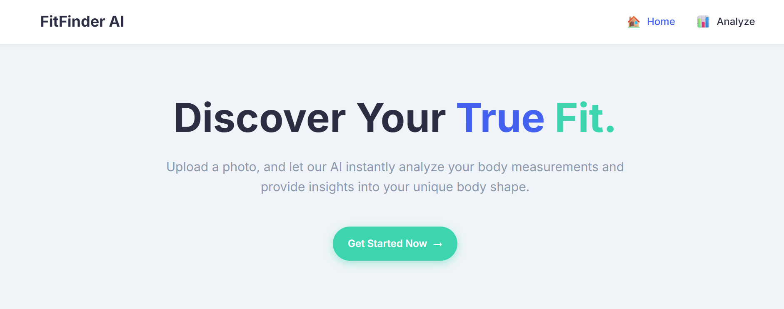
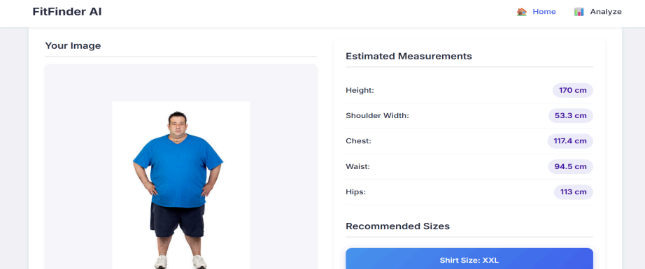
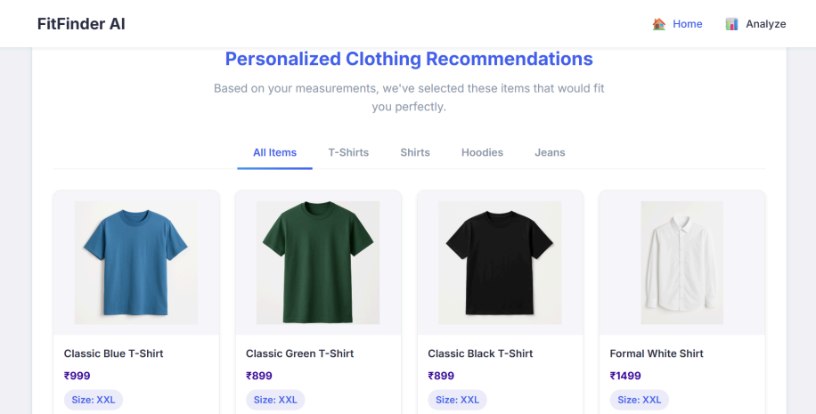

# Body Measurement app with Recommendations

## Overview
The Body Measurement App with Recommendations processes user-provided images to extract body measurements and suggest clothing sizes. The results are presented to the user through a clear and intuitive interface, including numerical measurements, size recommendations, and a visual representation of the detected body landmarks.








## Technical Stack

### Backend: 
- Python
- Flask
### Frontend: 
- HTML
- CSS,
- JavaScript
### Computer Vision: 
- MediaPipe Pose
- OpenCV (cv2)
- Werkzeug (for secure file uploads and image handling)
- NumPy

## Installation and Setup
### Clone the Repository:
```
git clone https://github.com/adnanmd-4567/body_measurement_app_with_recommendations.git
cd body_measurement_app_with_recommendations
```

### Install dependencies:
```
pip install -r requirements.txt
```
### Run the app:
```
python src/main.py
```
